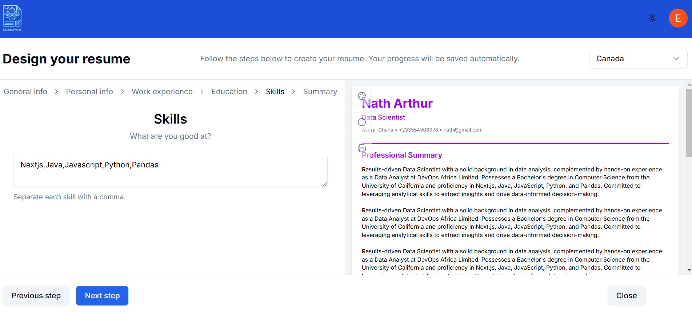

# CVisionary CV Builder Application 🚀



CVisonary, a cutting-edge CV Builder application designed to simplify the job application process for engineers and professionals. With AI integration for automated CV generation and Stripe-powered premium features, this application offers both convenience and customization.

## 🌟 Features

- **AI-Powered Quick Fill**: Automatically generates a professional CV summary using OpenAI integration.
- **Customizable Templates**: Multiple CV templates to suit various job roles.
- **Premium Features**:
  - Advanced template designs.
  - Enhanced AI suggestions for skill and experience optimization.
  - One-click export options (PDF).
- **Stripe Integration**: Secure payment gateway for unlocking premium features.
- **User Management**: Integrated with Clerk for seamless user authentication and management.

## 🛠️ Technologies Used

- **Frontend and Backend**: [Next.js](https://nextjs.org/) for fast, server-rendered React applications.
- **Styling**: Tailwind CSS for efficient and modern UI designs.
- **AI Integration**: [ChatGPT API](https://openai.com/api/) for generating summaries and content suggestions.
- **Database (Vercel storage)**: Neon Postgresql database
- **Payment Processing**: [Stripe](https://stripe.com/) for handling subscriptions and transactions.
- **Authentication**: [Clerk](https://clerk.dev/) for secure user management.

## 🎯 Use Cases

- **Job Seekers**: Effortlessly create professional CVs with minimal input.
- **Recruiters**: Offer candidates an intuitive tool to stand out.
- **Career Coaches**: Enhance sessions with personalized CV generation for clients.

## 🚀 Getting Started

### Prerequisites

- Node.js v20.15.1 or later.
- Stripe API keys for payment processing.
- OpenAI API key for AI integration.
- Clerk Account

### Installation

1. Clone the repository:

   ```bash
   git clone https://github.com/Justoo1/cvisionary.git
   cd cvisionary

   ```

2. npm install

### .ENV

3. Create a .env.local file and add the following environment variables:

- OPENAI_API_KEY=your_openai_api_key
- NEXT_PUBLIC_STRIPE_API_KEY=your_stripe_api_key
- CLERK_SECRET_KEY
- NEXT_PUBLIC_CLERK_SIGN_IN_URL=""
- NEXT_PUBLIC_CLERK_SIGN_UP_URL=""
- DATABASE_URL
- DATABASE_URL_UNPOOLED
- PGHOST
- PGHOST_UNPOOLED
- PGUSER
- PGDATABASE
- PGPASSWORD
- POSTGRES_URL
- POSTGRES_URL_NON_POOLING
- POSTGRES_USER="neondb_owner"
- POSTGRES_HOST
- POSTGRES_PASSWORD
- POSTGRES_DATABASE
- POSTGRES_URL_NO_SSL
- POSTGRES_PRISMA_URL
- BLOB_READ_WRITE_TOKEN

4. Start the development server:
   npm run dev

5. Open the app at http://localhost:3000.

# 📦 Deployment

Deploy on Vercel for a seamless deployment experience:
Connect your repository.
Set environment variables in Vercel settings.
Deploy!

📸 Screenshots

# 🤝 Contributing

We welcome contributions! Please fork the repo, create a feature branch, and submit a pull request.

Built with ❤️ by Justice Amankrah.
